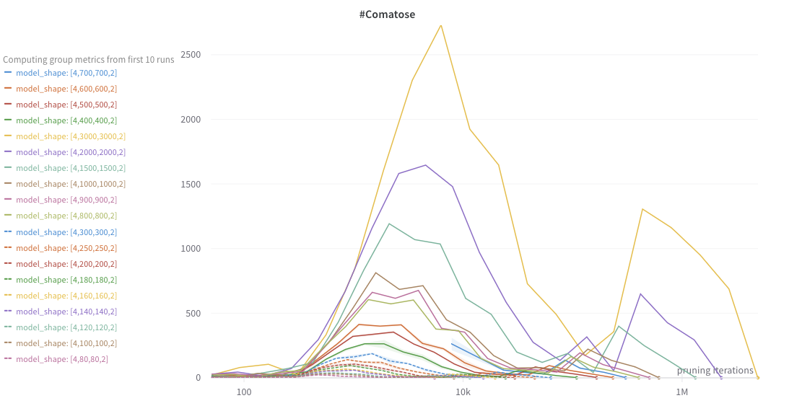
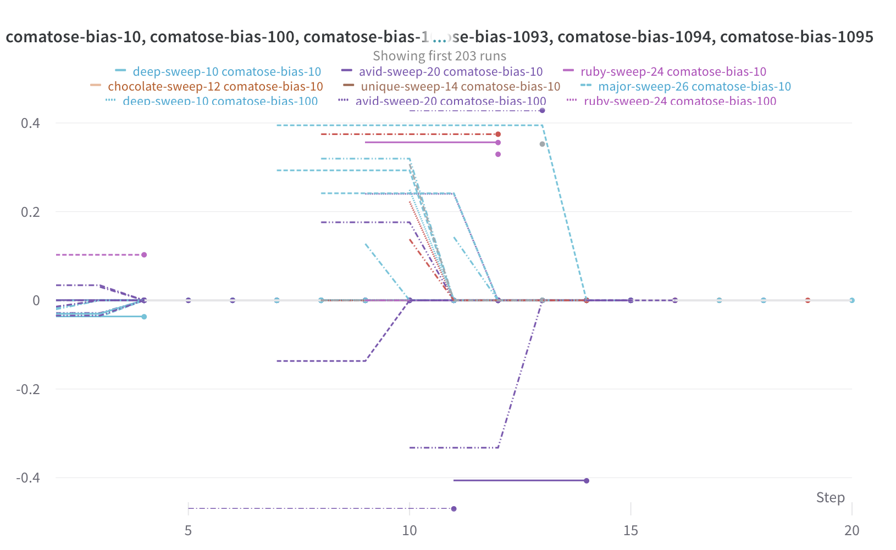

Idea

Goal

Why is it interesting ? 

Experiments inspired by BIMT

Does IMP find independent tasks? 
If the lottery ticket is good, it should not cointain unnecessary components. Therefore shouldnt have connections to random inputs

Idea :
Concatenate the Dataset together
2 Input 2 output.
Then experiment with IMP and see if the Model ends up as 2 sperate models
So far, this happens quite consistently. It is really expensive to measure how close we are to 2 disconnected models, so either it is disconnected or not.

This can be done with arbitrary many tasks.
Only classification though

Experiments on Regresssion with iterative Magnitude Pruning were not successful. Probably due to the inherent numerical Delicacy with Regression. Regression is Analog, Classification is digital.

So: Concatenaded Moons or Two * N Moons Dataset.
Training Lottery ticket works.
\__/ This is what the val_los graph should look like. Used early stopping to save time.

So far it doesnt seem to work
By the time the Network splits, it does not seem to be a lottery ticket anymore. It merely is a weak classifier. Lets try without noise? 


TODO: Try without noise. Find way to say (I want this model down to 40 params.) and the pruning rate is implicitly calculated, depending on the number of pruning iterations (which are the metric of money).

Fit an exponential curve to 2 points : number of prunable params before pruning and the desired number after pruning. This fitted exponential is discretized with n steps, where n is the number of pruning levels that are selected. 
This effectively creates a setup where it is easily possible to tune the hyperparameters. 
Network size and pruning iterations are the parameters that change the training time significantly.


TODO:
There are interesting Metrics I would like to track, ideally during training of a Soon-to-be-Lottery ticket.
* number of prunable / non-prunable parameters remaining and number of weights and number of biases.
* number of zombie neurons (Life)


New experimental results 'hezzefi6' show that the zombies survive longer when they have a large positive bias.

TODO: 
track the weights over time, where they end up. Delete weights that are 0. dont log them.


YAY! Milestone
I found a setup, where the NN splits before the network quality degrades substantially.
This is cool
The question also is
How likely is it, that the network splits exactly how I want it to be?
And, at what point should/could the network split first, and when will it split for sure.

There seems to be a relationship between not splitting and bad performance.


### params

multiplying the number of neurons in the hidden layer by n, increases the number of weights by a factor of n**2
The largest possible split subnetworks. lets say neural network has the number of parameters $P$ that covers $k$ equal task.
Then, the minimum number of weights to remove, such that the largest possible complete subnetworks arise is 
$$\frac{P(k-1)}{k}$$
and the minimum number of parameters where this split occurs is obviously 
$$\frac{P}{k}$$


## Observations
* Zomie Neurons appear more often at higher sparsities
* Zombie Neurons can appear to survive longer if their associated bias is larger. Zombies with negative, 
* Comatose Neurons appear to only survive for few iterations
* Comatose Neurons behave very similarly across different seed-runs  
    * why? As soon as they become comatose, they do not receive any updates. When the average parameter rises, they lower relatively to the others.
* Negative Biases disappear (pruned, turn positive) --> RELU -> negative bias increases likelihood of 0-Activation and therefore no update which increases likelihood of pruning.

the pruning horizon. It increases steadily. 


## Experiments to run

What is actually interesting to test? What are the Hypothesis?

Hypothesis :
New experiment, broader hidden size.
What do I expect ? 

Comatose Neurons seem to follow a pattern like existence. First a peak, as the randomly dying neurons click out. Then they start to disappear fast. Then, the features that are deleted on purpose 


This graph looks very cool  and is actually interesting.
It looks like the peak is relative between beginning and end.
So say, the peaks is **always** around iteration 12 of 20. lets say 11-13


Notes on experiments
the runs were fast up until 2 layer 600 or say 700.
Then tey quickly started to get very looong.

Now lets do experiments up until 300k parameters. Later it gets really really slow


# Plotting Network splitting

Goal. I want to see how network size (number of parameters) influences splitting pf the network.
To really compare, the networks would need to be pruned at the same parameters. 

When I keep the pruning iterations constant, but increase P, then the pruning rate is larger and the steps are at different numbers.

Then, it is hard to compare, since the steps where the network would exist are at different place, with different distances to each other.
How can we avoid that? 

Increasing P leads to an increased

Could compare: 
* one more pruning iteration and increase the number of parameters by *pr*, so that after 1 pruning iteration, the network has the same number of parameters.
* also simply increase the number of pruning iterations, without increasing P.

Then, if increasing parameters yields better results, more parameters mean better splitting.

Experiment setup:

I have a model with a defined Shape $S_0$ and associated number of prunable parameters $P_0$.
I decide for a pruning target $P_T$, the number of prunable parameters left after $T$ iterations of pruning.
The pruning rate $p$ is implicit form $P_0$, $P_T$ and $T$.  

The model can be extended. To extend the model according the the pruning trajectory $[P_0, P_1,...P_{T-1},P_T]$, the inverse pruning rate, or growing rate $g$ is calculated as follows
$$(1-p)*(1+g) = 1 \quad g = \frac{1}{1-p} - 1$$

To to get the shape of the extended model $S_{-1}$, first the number of parameters are calculated $P_{-1} = P_0 * (1+g)$.
The parameters are rounded to an integer, and the solve for the simple equation for the hidden dimension, which is the only variable in $S$ that we can change.

This can be generalized to 
$$
P_{-k} = P_0 * (1+g)^k
$$

The trajectory is simply extended, such that pruning $P_{-1}$ for one iteration yields $P_0$, which makes the networks comparable based on the number of prunable parameters they have.

### TODOs

What are the minimum defining characteristics for extending a network? 
Number of extensions, pruning rate, initial shape

create pruning trajectory at beginning of experiment. 
Optionally extend network and pruning trajectory. 
optionally only increase pruning iterations? but then, also the number of weights at times is different.

Experiments:
* different number of layers (do zombies and comatose occur at different times?)
* comates and zombie layers - is there a pattern over pruning-time?
* increase number of task
* add noise to the task (shrink the dataset for speedup?)


Final Boss:
* see zombies and comatose at MNIST
* concat MNIST (FASHION) and see if it splits
* 


## interesting finding! 
comatose neurons biases are often pruned, before they are deleted


Why is that?
- the avg magnitude grows faster than the biases which dont change anymore in comatose neurons.
- pruning comatose biases is a complete waste of resources.
How often does it happen?   


# Important changes made to initialization

Initialize with kaiming uniform
and initialize biases with 0
https://cs231n.github.io/neural-networks-2/
https://pytorch.org/docs/stable/nn.init.html#torch.nn.init.kaiming_uniform_


Interesting development:
Now when I use the new, apparently correct kaiming initialization, the network does not split anymore.
All weights get pruned except the ones in the input layer.
This is weird but interesting.
Investigating currently.

how did frankle do it? 
kaiming, but his network had reletively similar input dim to hidden dim ratio.
https://github.com/facebookresearch/open_lth/blob/2ce732fe48abd5a80c10a153c45d397b048e980c/models/initializers.py

now using simple normal distribution for the layers, since it is a toy task. Dont use the pytorch default, as it cannot be argued for.

Experiments on 23.11.

Training with the new datasets.
Using the concat datasets, there is the phenomenon that the performnance doesnt increase with model size. Or rather, that early stopping is triggered early. Why is that? Maybe because the network has many more parameters than there are samples in the dataset. Lets try doubling the number of samples

Increasing the datset size helps. however somehow the performance on the combined dataset with the circles isnt as good 
This might be due to the ability to predict.

The reason was that the circle dataset was not predictable. overlapping class distributions.
Changing the 'factor' from 0.8 to 0.5. This makes the classes better seperable.
Now the combined dataset trains to 0.01 Loss.
original torch https://github.com/pytorch/pytorch/blob/main/torch/nn/modules/linear.py

### Zombies
How can we look at the NN from a different perspective? Directed Acyclic Graph view.
The first differentiation can be made into subgraphs either change the network output or not. Assuming there are only linear layers and activations.
A subgraph that doesnt change the network output is *unproductive*.
It either :

- has no connections to the output. A feature with zero output connections is a head of an unproductive subgraph. (excluding output_features themselves). All parent features of the unproductive feature belong to the uproductive subgraph if all other children of the parent are also unproductive. If it has at least one child that is productive ( meaning it can change the output), it is also productive.

- produces a constant activation of 0 assuming that network input is completely unknown. This can occur, if the input of the feature is predictable. e.g. there are no inputs but a negative bias with ReLU or no inputs and 0 bias.

On the other hand there are *productive* subgraphs.
These are simply all subgraphs that are not unproductive.

Within the productive subgraphs, there are some interesting distinctions to make.
The only 'valuable' subgraphs of the productive ones are the ones,
that are somehow connected to the network input. and actually use it.

Productive features, that do not receive any information from the input features are termed 'zombie features'. 
All child features of a zombie feature, that only has zombie parents is also a zombie feature. All zombie features that are connected with weights form a 'zombie subgraph'.


However, amongst the zombies there is yet another distinction to make, that is relevant. 
There are are **frozen** zombies. These are zombies, where the parameters will stay the same, because they will receive 0 gradients.
Since zombies have no connection to the input, their preactivation must come from somewhere, otherwise it is 0, therefore the activation is 0 (assuming RELU) and their Gradient is also 0. So the weight would not change based on gradient updates from alone (ignoring weight decay and L1 or L2 Regularisation)

When this happens, these zombies are actually unproductive parameters and behave exactly the same way.

The most interesting zombies are the productive ones.


ALL parameters can be put into 1 of 5 states:
1. alive  : connected to input and output
2. audience : only receives input from zombies
3. zombie : no inputs but a bias
4. unproductive : no influence on output of network
5. pruned : parameter is set to 0 aka removed

One can only go from 1 in the direction of 5, and not the other way. Each from each state, each lower state is reachable.

One can track the state of each parameter as a 5-Tuple, that contains the number of iterations the parameter was in the state.


# TODO: 
some next steps. To check the path from the network towards splitting into 2. 
Idea: Take the number of tasks and create a matrix of that size TxT. If all tasks are split perfectly as the should be, this matrix should look like the identity matrix. 


This is done now. A simple metric for now is as follows.
A value describes the splitting state
if this value is 0, the network is perfectly split, all features are in the networks they belong to. 
If it is larger than 0, the network has still the possibility to go to the perfect split. The integer number implies the number of splits necessary to achieve this.
If the value is below 0, this indicates that the network cannot reach the perfect split anymore. The value is the `potential` - 1. Potential refers to the number of in-out pairs that are still available in the collection of networks. Every 'bad' split, decreases this number. As long as there is no bad split, potential == 1. When none of the in-out pairs remain, potential is 0. Therefore our metric is -1, which is the lowest possible value.


2. **Compute the Norm at Each Step**: At each iteration or step in your process, compute the chosen norm of the difference between the current matrix \( A_k \) and the identity matrix \( I \). This calculation will give you a measure of how "far" your current matrix is from being an identity matrix.

   For instance, using the Frobenius norm, you would compute:
   \[
   \| A_k - I \|_F
   \]
   at each step \( k \).

3. **Track the Changes in the Norm**: Plot or record the value of the norm over each iteration. A decreasing trend in this value indicates that the matrix is converging towards the identity matrix. The closer the norm is to zero, the closer your matrix is to the identity matrix.

4. **Establish a Convergence Criterion**: You might want to define a threshold for the norm value, below which you consider the matrix to have effectively converged to the identity matrix. This threshold depends on the precision requirements of your specific application.

5. **Analyze the Convergence Rate**: The rate at which the norm decreases can also give insights into the convergence behavior. A rapid decrease might indicate fast convergence, while a slow or stagnating decrease could signal issues in the convergence process.

This method gives a quantitative and systematic way to monitor the convergence of a matrix towards the identity matrix across iterations.
```


Found a setup where it splits again.
Somehow the bias-as-zero initialization doesnt split so well.
Might be interesting to check this out, what happens inside differently.
Anyways, this is the run path to the splittery boy mxmn/concat_moons/f20n8zem


Nice neew developments. The splitting works. Now it is just a matter of interesting experiments. 
What is still missing is plotting the lifetimes.

# TODOS

- [ ] connect accuracy to task metric. Why is one task so much worse than the other? And why is it always the same one. 
- [ ] plot the lifetimes.


## Train test split
switch to the given train test split implementation of sklearn.

## Early Stopping
find a way for using early stopping. 
For now, loss cutoff works unreasonably well. 
But we need a more general early stopping mechanism.
One that has more reasoning behind it.
Somehow the model.


Goal: 
